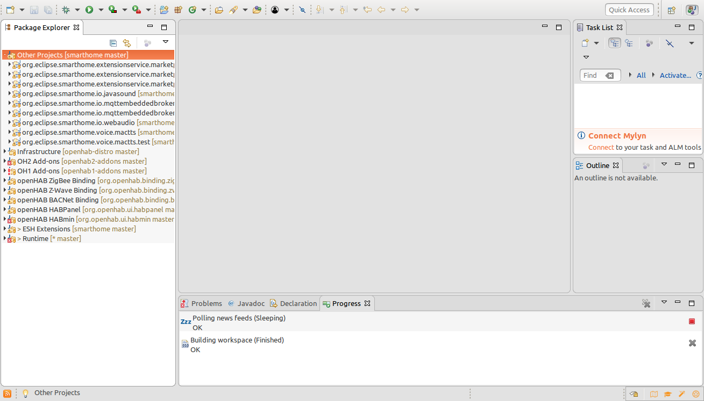
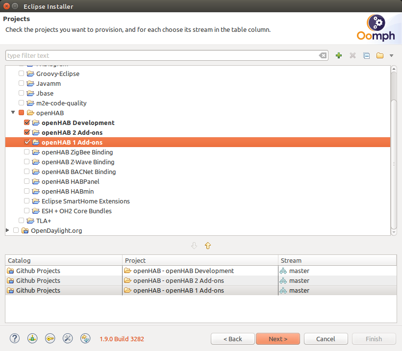
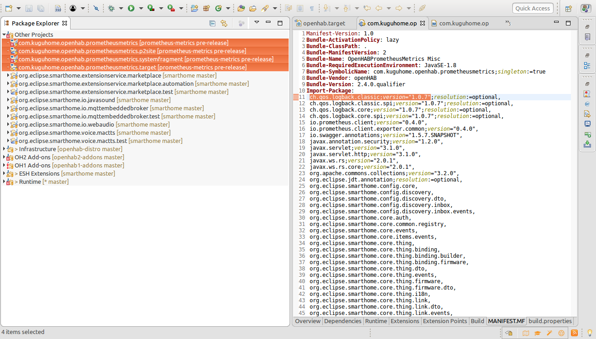
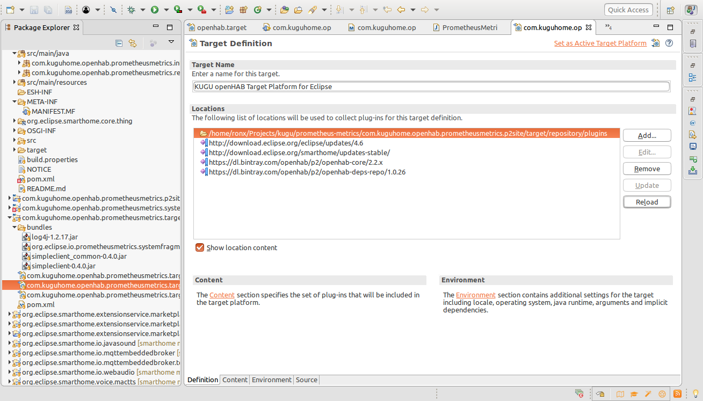
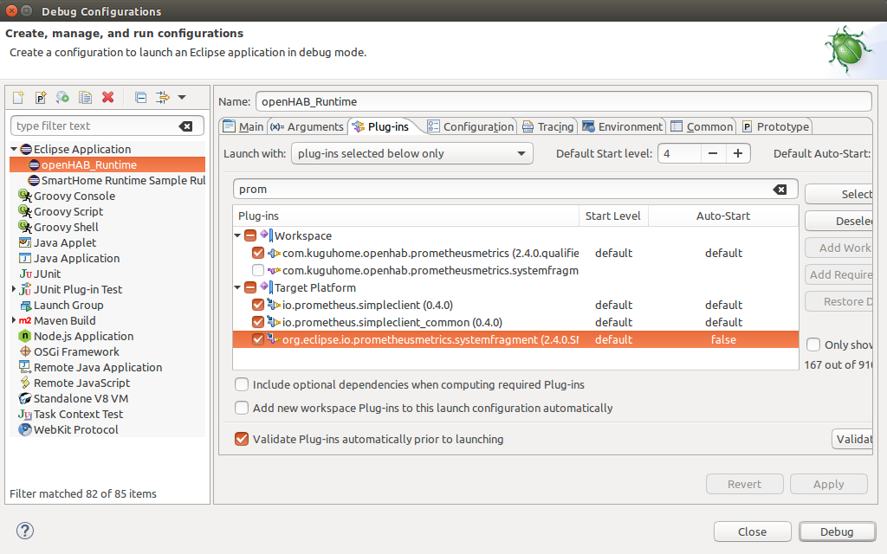
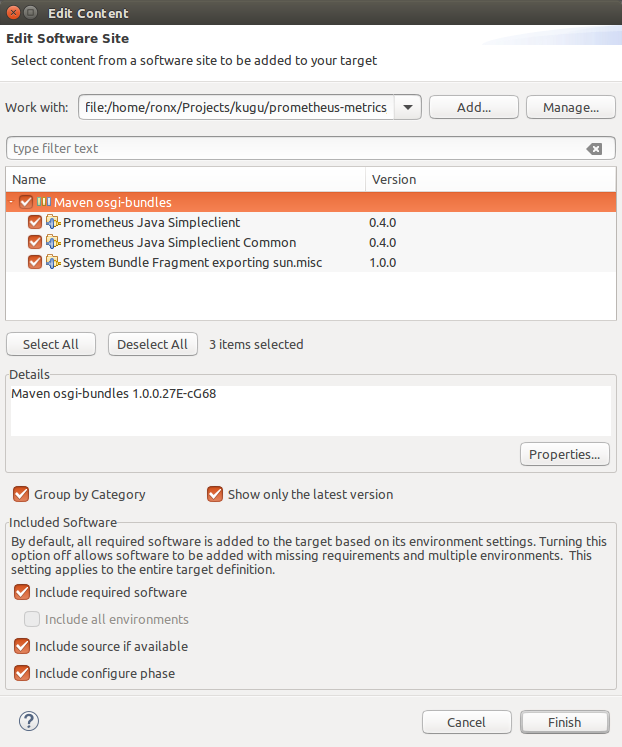
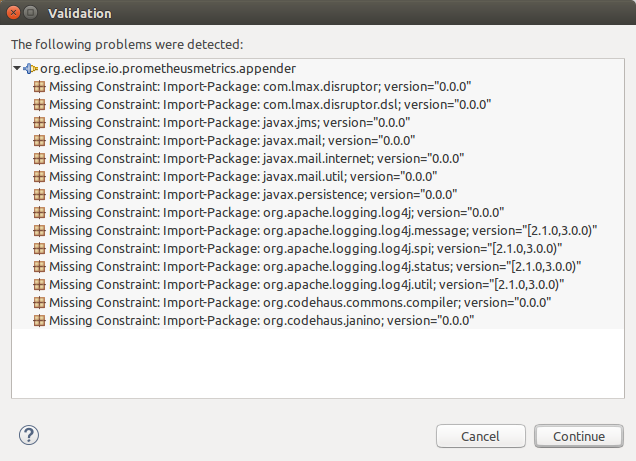
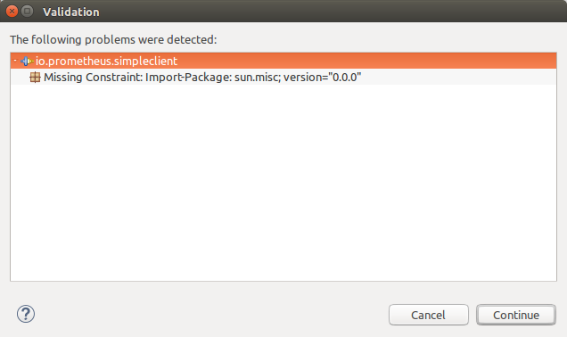
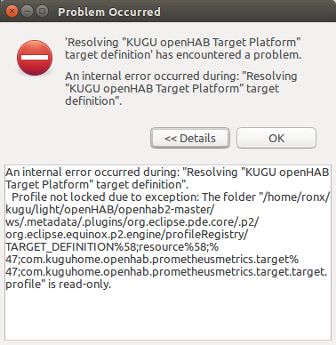

## openHAB bundle for Prometheus metrics

### Development environment
* Setting up the openHAB IDE https://www.openhab.org/docs/developer/development/ide.html#prerequisites

You should have your IDE almost the same as on picture (if you select all projects to import in bullet above):


We would suggest to import not all to increase local build process:


* Import Kugu projects into IDE:
File -> Open Projects From File System...
Select projects and import
Your IDE should be like here:

  
* Set active Target
Open com.kuguhome.openhab.prometheusmetrics.targeteclipse.target file in Eclipse IDE
Change locations of the bundles to the path on your local machine
Save the file
Click Reload
Click Set as Active Target Platform


* Select Debug configuration
Click Debug -> Debug Configuration and select all plugins on third tab which will be present after typing "prom" in textbox

Click Apply and Debug

* You should see the console appeared after the build

### Development process

* Add repository created with p2:site goal


### Possible issues and problems

* Version absence

check your MANIFEST file for every artifact in the list and put appropriate version. Example:
```
ch.qos.logback.classic;version="1.0.7",
```
* Package sun.misc

We created separate bundle fragment to deal with this problem. Check if this fragment added to your Target


* Target file error
You can face with such error during work with .target file:

We didn't resolve this problem so there is one way to return to stable environment - to select default .target file
You can find it the project Infrastructure -> launch -> openhab.target
Then here you can add bundle folder with necessary bundles


### Resources
* Documentation of prometheus' data format https://prometheus.io/docs/concepts/metric_types/
* Developing Bindings https://www.eclipse.org/smarthome/documentation/development/bindings/how-to.html
* Java library for prometheus https://github.com/prometheus/client_java
* HABmin as a reference how to implement a UI https://github.com/openhab/org.openhab.ui.habmin
